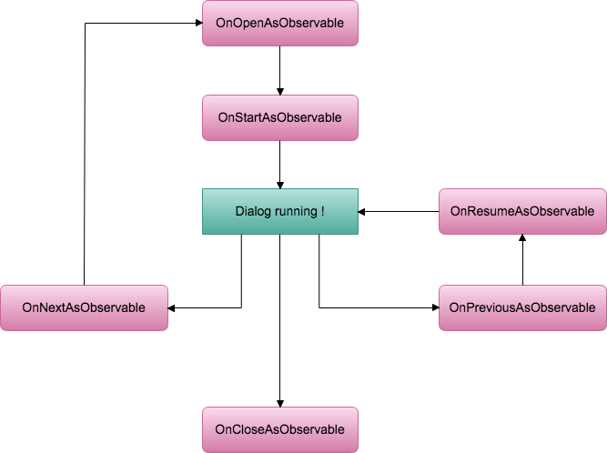

# Dialog
Dialog Module.  


## DialogSettings
Resources/DialogSettings.asset


## Usage
```cs
using SocialGame.Dialog;
```

### Example
Assets/Plugins/SocialGameTemplate/Examples/Dialog/DialogExample.unity

### Example: Usage
```cs
[Inject] private IDialogController _dialogController;
private void Example() {
  _dialogController.Open<string>(DialogType.Sample, UnityEngine.Random.Range(0, 100).ToString()))
    .Subscribe(x => Debug.Log(x))
    .AddTo(*);
}
```

### Example: implementation
```cs
public class DialogExample : MonoBehaviour, IDialog {
  public UniTask OnOpen(float defaultDuration) {

  }
  public UniTask OnClose(float defaultDuration) {

  }
  public UniTask OnStart(object param) {

  }
  public UniTask OnResume(object param) {

  }
  public IObservable<RequestDialog> OnNextAsObservable() {

  }
  public IObservable<object> OnPreviousAsObservable() {

  }
}
```

### Lifecycle

